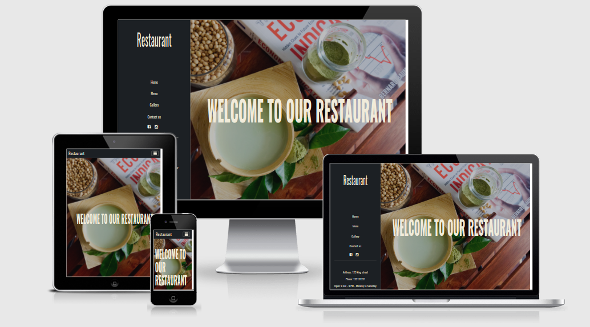

# **Static_Page_Restaurant**
## [Heroku Url](https://soyo-bar.herokuapp.com/index.html)

Single static page for a restaurant.
This website is an example of a clean, simple one page layout for a small restaurant/bar offering wanting to showcase some of their offer without the need of advanced features. 
===================================
## Infos
- Time spent: 7 Hours Design + code
- Photos all taken by me with Sony Alpha A5000
- Text Editor: VS Code
- Photo Editor: Affinity Photo
---
## Framework and preprocessors
- Jquery
- Bootstrap 4
- Scss
---

---

## License

    Copyright [2017] [Alberto Montalesi]

    Licensed under the Apache License, Version 2.0 (the "License");
    you may not use this file except in compliance with the License.
    You may obtain a copy of the License at

        http://www.apache.org/licenses/LICENSE-2.0

    Unless required by applicable law or agreed to in writing, software
    distributed under the License is distributed on an "AS IS" BASIS,
    WITHOUT WARRANTIES OR CONDITIONS OF ANY KIND, either express or implied.
    See the License for the specific language governing permissions and
    limitations under the License.